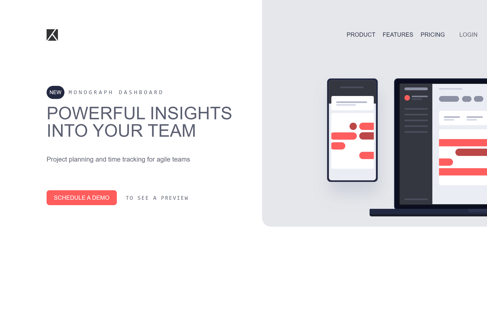

# Frontend Mentor - Project tracking intro component solution

This is a solution to the [Project tracking intro component challenge on Frontend Mentor](https://www.frontendmentor.io/challenges/project-tracking-intro-component-5d289097500fcb331a67d80e). Frontend Mentor challenges help you improve your coding skills by building realistic projects. 

## Table of contents

- [Overview](#overview)
  - [The challenge](#the-challenge)
  - [Screenshot](#screenshot)
  - [Links](#links)
- [My process](#my-process)
  - [Built with](#built-with)
  - [What I learned](#what-i-learned)
  - [Continued development](#continued-development)
  - [Useful resources](#useful-resources)
- [Author](#author)

**Note: Delete this note and update the table of contents based on what sections you keep.**

## Overview

### The challenge

Users should be able to:

- View the optimal layout for the site depending on their device's screen size
- See hover states for all interactive elements on the page
- Create the background shape using code

### Screenshot

### Links

- Solution URL: [Add solution URL here](https://github.com/Gito125/tracking-intro-component-master)
- Live Site URL: [Add live site URL here](https://your-live-site-url.com)

## My process

### Built with

- Tailwindcss

### What I learned

How to use basic tailwindcss classes

### Continued development

More depth in tailwindcss

### Useful resources

- [Tailwindcss](https://tailwindui.com/) 

## Author Ogwang Gift Gideon.

- Frontend Mentor - [@Gito125](https://www.frontendmentor.io/Gito125)
- Twitter - [@Gito](https://twitter.com/OgwangGift) 
